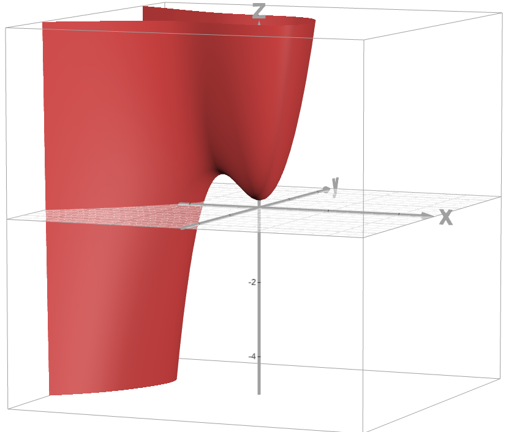

# Question 2

- llustrate the concept of a convex function with a simple example (e.g., a parabola)
and a non-convex function (e.g., a multi-modal function).
- Discuss why convex problems are generally easier to solve and how this impacts
data science tasks such as linear regression.
- Give one practical example of a non-convex optimization scenario in machine
learning (e.g., training a neural network). Why can it be difficult to find a global
optimum in such cases?

## Answer

In this question, we'll explore the fundamental differences between convex and non-convex functions, their optimization characteristics, and practical applications in machine learning.

## Key Concepts

### Understanding Convex vs Non-Convex Functions

The images in the comparison table below illustrate the key differences:

- The convex function (left) shows a smooth, bowl-shaped curve with a single global minimum
- The non-convex function (right) exhibits multiple peaks and valleys, resulting in multiple local minima

### Why Convex Problems Are Easier to Solve

Convex optimization problems are preferred in data science because:

1. They guarantee a global optimum
2. Any local minimum is also the global minimum
3. Gradient-based methods converge reliably

A classic example is linear regression, where the mean squared error (MSE) loss function creates a convex optimization landscape, ensuring we find the best possible solution.

### Non-Convex Optimization in Practice

Neural network training is a prominent example of non-convex optimization:

- The loss landscape contains multiple local minima
- Different initializations can lead to different solutions
- Optimization algorithms may get stuck in suboptimal local minima

This is why deep learning often requires techniques like:

- Multiple random initializations
- Learning rate scheduling
- Advanced optimizers (Adam, RMSprop)

The visualization in the table clearly shows why finding a global optimum is straightforward in convex cases but challenging in non-convex scenarios.

### Visual Comparison of Convex vs Non-Convex Functions

| Function Type | Visualization |
|--------------|---------------|
| Convex Function |  |
| Non-Convex Function |  |

**`Note`**
&nbsp;A convex function is characterized by having a single global minimum, where any line segment between two points on the function lies above or on the function's graph. In contrast, a non-convex function may have multiple local minima, making optimization more challenging.
