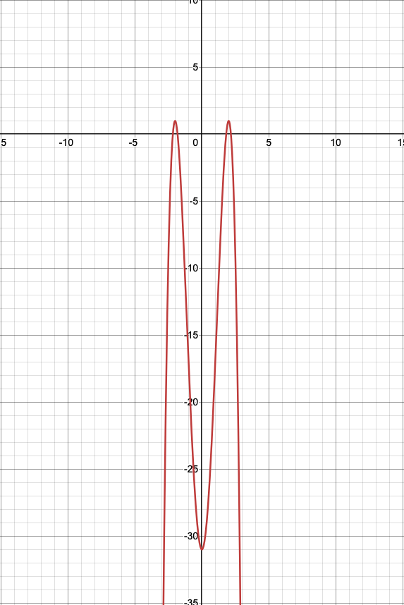

# Definition with real-life examples

***`Objective function`*** &nbsp; Objective function is the function which is needed to be maximized or minimized based on optimization problem definition. It represents the goal or purpose of the optimization. The objective function can represent various quantities depending on the application, such as cost, weight, profit, or any other measure of performance that needs to be optimized.

e.g.
&nbsp; An operation research problem(Travelling Salesman Problem, Inventory management Problem, etc), any Machine Learning Problem. Where one is trying to minimize the machine generated output to deviate minimum from the actual behaviour.

***`Constraints`*** &nbsp; Constraints are real world limitations or nature bounded regulations which impacts the region under which optimization can be performed.
e.g.
&nbsp; Production capacity of a certain agricultural plant. Maximum load capacity of a transport vehicle. Or maximum shelf life of a particular food product.

***`Feasible region`*** &nbsp; It is the region consisting of all points which satisfies the objective function as well as all the constraints associated with it. The optimal solution will always be part of the feasible solution.

e.g.
&nbsp; Consider a bakery that produces cakes and cookies. They have constraints like:

- Maximum 100 kg of flour available per day
- Only 8 hours of oven time available
- Limited storage space for 200 finished items

The feasible region would be all possible combinations of cakes and cookies that can be produced while staying within these resource limitations.

---

## Simple Case Study: Monthly Personal Budget

Consider a person planning their monthly expenses with these constraints:

- Total monthly income: $3000
- Must spend at least $800 on rent
- Must allocate $400 for utilities and basic needs
- Needs to save minimum $500 for emergencies

The feasible region for discretionary spending (entertainment, shopping, etc.) is limited to $1300 or less due to these financial constraints.

This demonstrates how real-world constraints create boundaries that limit our possible choices, even in everyday decisions.

---

## Local Optimum vs Global Optimum

### Core Definitions

- **Local Optimum**: A solution that is the best within a neighboring set of solutions, but not necessarily the best possible solution overall
- **Global Optimum**: The absolute best solution possible within the entire search space

### Visual Analogy

Think of climbing a mountain range:

- Local optima are like reaching the top of individual peaks
- The global optimum is the highest peak in the entire range
- From a local peak, all nearby steps lead downward, making it difficult to know if higher peaks exist elsewhere

### Mathematical Perspective

```python
# Example of a function with multiple optima
def f(x):
    return -2 * (x-2)**2 * (x+2)**2 + 1
```



### Why Local Optima May Be Acceptable

1. **Computational Efficiency**
   - Finding the global optimum often requires exhaustive search
   - Local optima can be found with less computational resources
   - In real-time applications, quick "good enough" solutions are valuable

2. **Problem Complexity**
   - Many real-world problems are non-convex with multiple optima
   - The difference between local and global optima might be negligible
   - The cost of finding the global optimum may outweigh the benefits

3. **Practical Constraints**
   - Time limitations in business settings
   - Hardware resource constraints
   - Budget considerations

4. **Domain-Specific Considerations**
   - In machine learning: Local optima might provide sufficient model performance
   - In optimization: Multiple local optima might represent equally valid solutions
   - In decision-making: A "good enough" solution allows for faster implementation

### Real-World Applications

1. **Machine Learning**
   - Neural network training often settles for local optima
   - Gradient descent algorithms frequently converge to local minima
   - Ensemble methods can help mitigate the impact of local optima

2. **Business Optimization**
   - Resource allocation problems
   - Supply chain optimization
   - Production scheduling

### Methods to Handle Local Optima

1. **Random Restarts**
   - Initialize from multiple starting points
   - Keep track of the best solution found

2. **Metaheuristic Approaches**
   - Simulated annealing
   - Genetic algorithms
   - Particle swarm optimization

### When to Accept Local Optima

1. **Solution Quality Metrics**
   - When the solution meets predetermined quality thresholds
   - When improvements are marginal beyond certain points

2. **Resource Considerations**
   - Time constraints
   - Computing power limitations
   - Cost-benefit analysis

3. **Problem Characteristics**
   - When the problem space is too large to explore exhaustively
   - When the difference between local and global optima is known to be small

---
